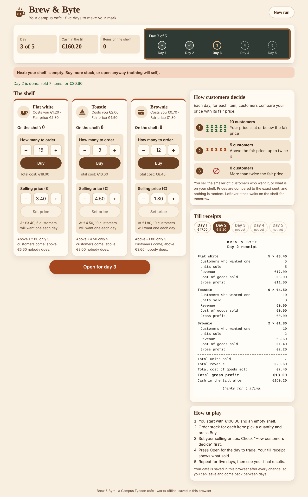
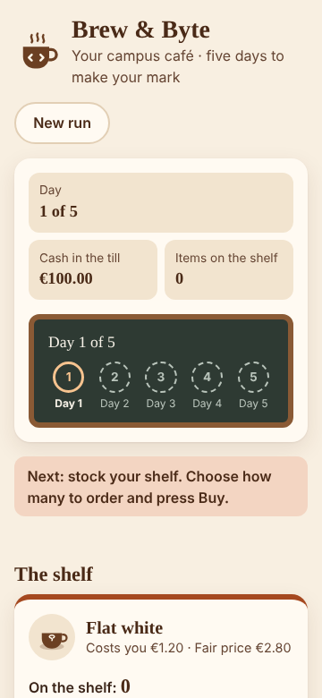
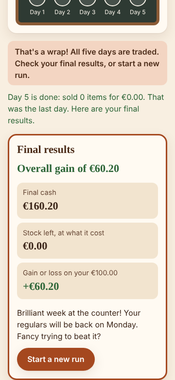
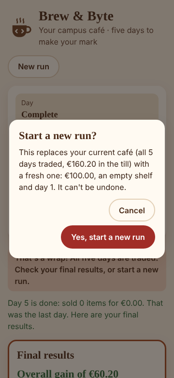

# Brew & Byte

**Run a campus café for five days.** Start with €100 and an empty shelf, buy flat whites, toasties and brownies, set your prices, and open for the day. The till prints a receipt of what sold. After day five, see whether your café made money.

Brew & Byte is the first release of _Campus Tycoon_ (Product 02) for the Nova SBE Introduction to Programming course. It is a TypeScript web app with no backend and no network use: it works offline and saves your progress in the browser.



<p>
  
  
  
</p>

More screenshots: [start](docs/screenshots/desktop-1-start.png) · [final results](docs/screenshots/desktop-3-final.png) · [new run dialog](docs/screenshots/desktop-4-new-run-dialog.png) · [dark theme](docs/screenshots/desktop-5-dark.png)

## How to play

1. You start with **€100.00** and nothing on the shelf.
2. **Buy stock:** choose a quantity with the − / + stepper (or type it) and press **Buy**. The total cost is shown as you go; orders you can't afford are blocked.
3. **Set prices:** type a price (`2.80` or `2,80`) and press Enter, or nudge it by 10 cents.
4. Check **How customers decide**: at or below the fair price, 10 customers come; up to twice it, 5; above that, nobody.
5. Press **Open for the day**. You sell the smaller of demand and your stock. Leftovers stay on the shelf.
6. Repeat until day 5, then read your **Final results**. **New run** starts over (after asking).

| Item       | Unit cost | Fair (reference) price |
| ---------- | --------- | ---------------------- |
| Flat white | €1.20     | €2.80                  |
| Toastie    | €2.00     | €4.50                  |
| Brownie    | €0.70     | €1.80                  |

## Run it

You need **Node.js 20.19 or newer** (which includes npm) and git.

```bash
git clone https://github.com/EthanCalvert22/Ethan-Intro-to-Programming-project.git brew-and-byte
cd brew-and-byte
npm ci
npm run dev
```

Open the address it prints (usually <http://localhost:5173>).

To build the production version and serve it:

```bash
npm run build
npm run preview      # usually http://localhost:4173
```

The built files in `dist/` are plain HTML, CSS and JavaScript with relative paths, and make no network requests.

## Test it

```bash
npm test                 # unit + acceptance tests, with coverage
npm run lint             # ESLint (zero warnings allowed)
npm run format:check     # Prettier
npm run typecheck        # tsc --noEmit
```

End-to-end tests drive the real built app in headless Chromium. The first time on a new machine, install the browser:

```bash
npx playwright install --with-deps chromium
npm run test:e2e
```

What a pass looks like: `npm test` ends with `Tests 299 passed (299)` and a coverage table with no `ERROR` lines, and `npm run test:e2e` ends with `22 passed`. `npm run screenshots` regenerates the images in `docs/screenshots/`.

CI (GitHub Actions, [`.github/workflows/ci.yml`](.github/workflows/ci.yml)) runs all of these on every push and pull request, on Node 20 and 22.

## How it is built

```
spec/           the rules as data: catalogue.json, acceptance.json (A1–A6 + extra cases), RULES.md
src/domain/     the rulebook: pure functions, money in whole cents, no saving, no screen
src/storage/    saving and loading the run (one localStorage key: brew-and-byte:run:v1)
src/ui/         the screen: shelf cards, day chalkboard, till receipts, final results, dialog
tests/          Vitest: domain, storage, screen (jsdom), seeded property tests, acceptance runner
e2e/            Playwright: full run, reload, dialog, keyboard, axe accessibility, phone width
docs/           decisions, plain-language explanation, test map, limitations, screenshots
```

- **Money is stored in cents** (`€4.01` is `401`), so prices and totals are exact.
- **Every action is checked by the rules, saved, and only then shown.** Refused actions change and save nothing; a traded day and its new balances are saved in one write, so reloading never replays a day.
- **Damaged saves don't crash the app.** It explains the problem, keeps a backup, and starts fresh only when you ask.
- **Accessible:** labelled inputs, `aria-live` announcements, keyboard play, visible focus, AA contrast in light and dark themes, reduced motion respected.

## Documentation

- [docs/EXPLAINED.md](docs/EXPLAINED.md): the whole project in plain language, with a file tour, rule-to-code table, Q&A and glossary
- [spec/RULES.md](spec/RULES.md): the game rules
- [docs/DECISIONS.md](docs/DECISIONS.md): choices made where the brief was open, with reasons
- [docs/TESTING.md](docs/TESTING.md): how each requirement and scenario maps to tests, and the latest results
- [docs/KNOWN_LIMITATIONS.md](docs/KNOWN_LIMITATIONS.md)
- [docs/PLAN.md](docs/PLAN.md): the build plan

## Future work

Ideas for after the first release (deliberately not built): random daily events such as rain or exam week, upgrades like a second coffee machine, a competing café across campus, spoilage for fresh items, a smoother demand curve, and a history chart across runs.
